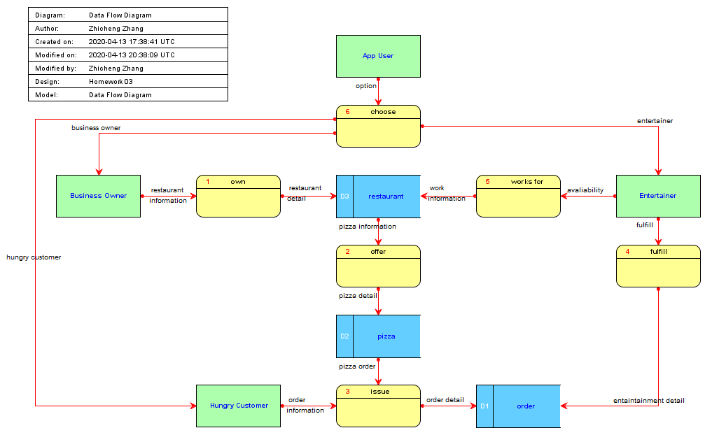
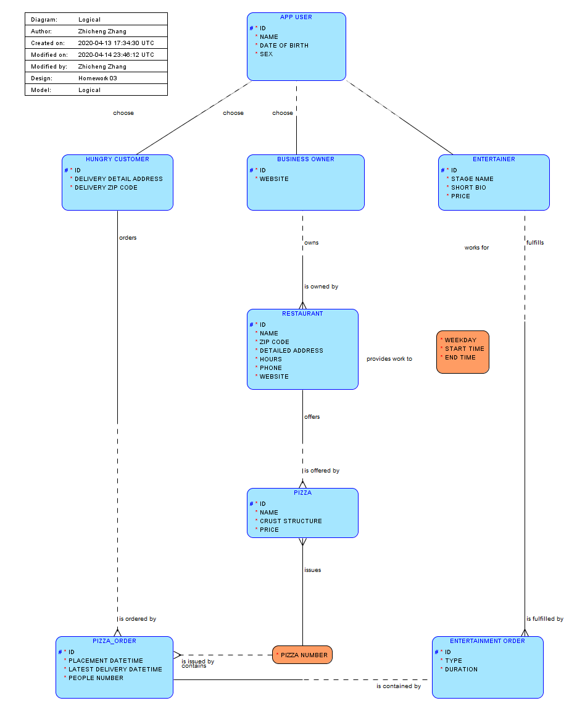
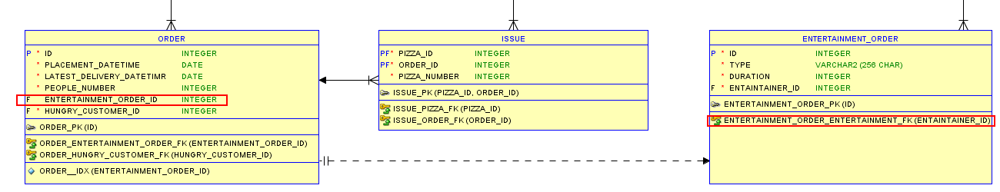
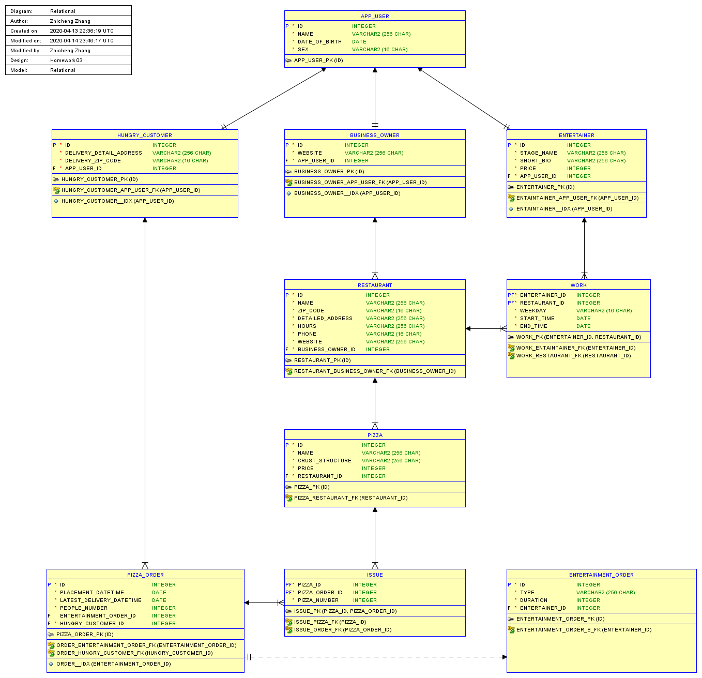
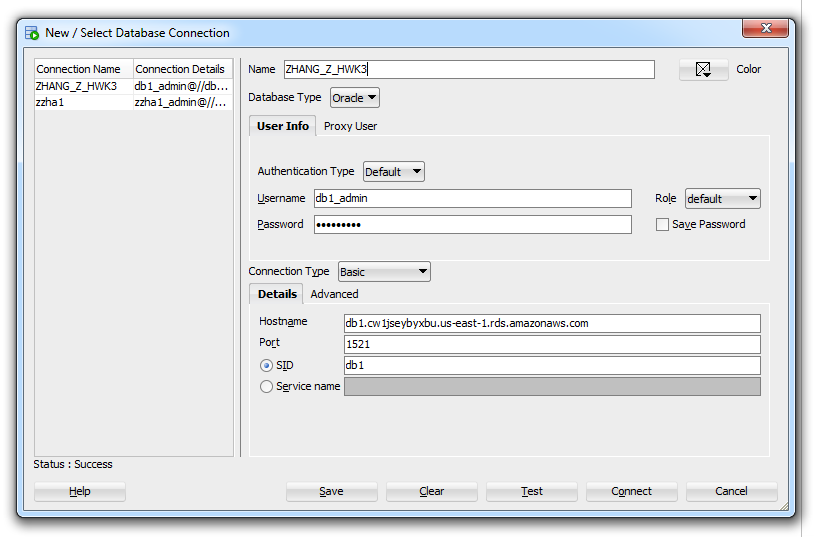
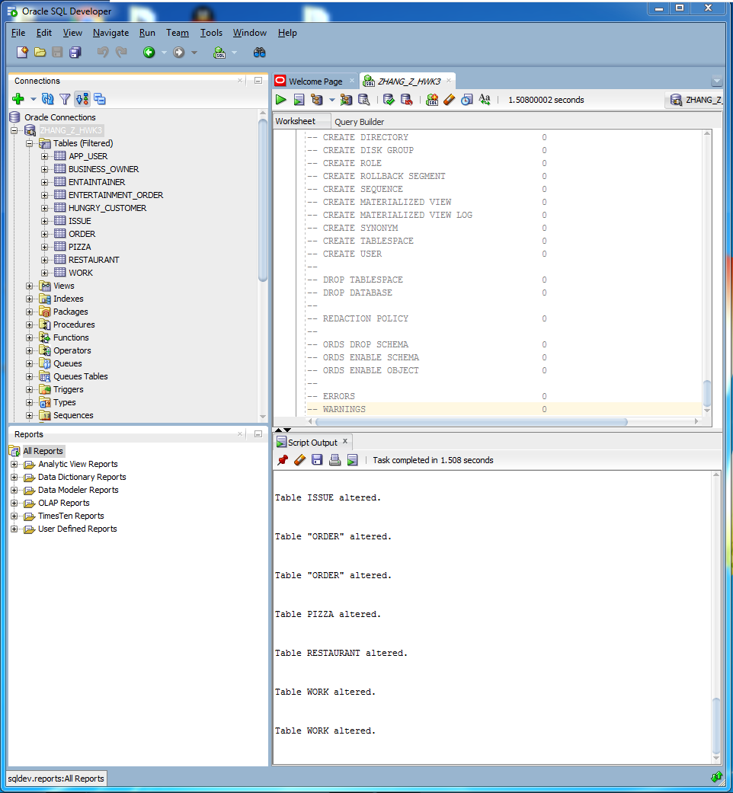
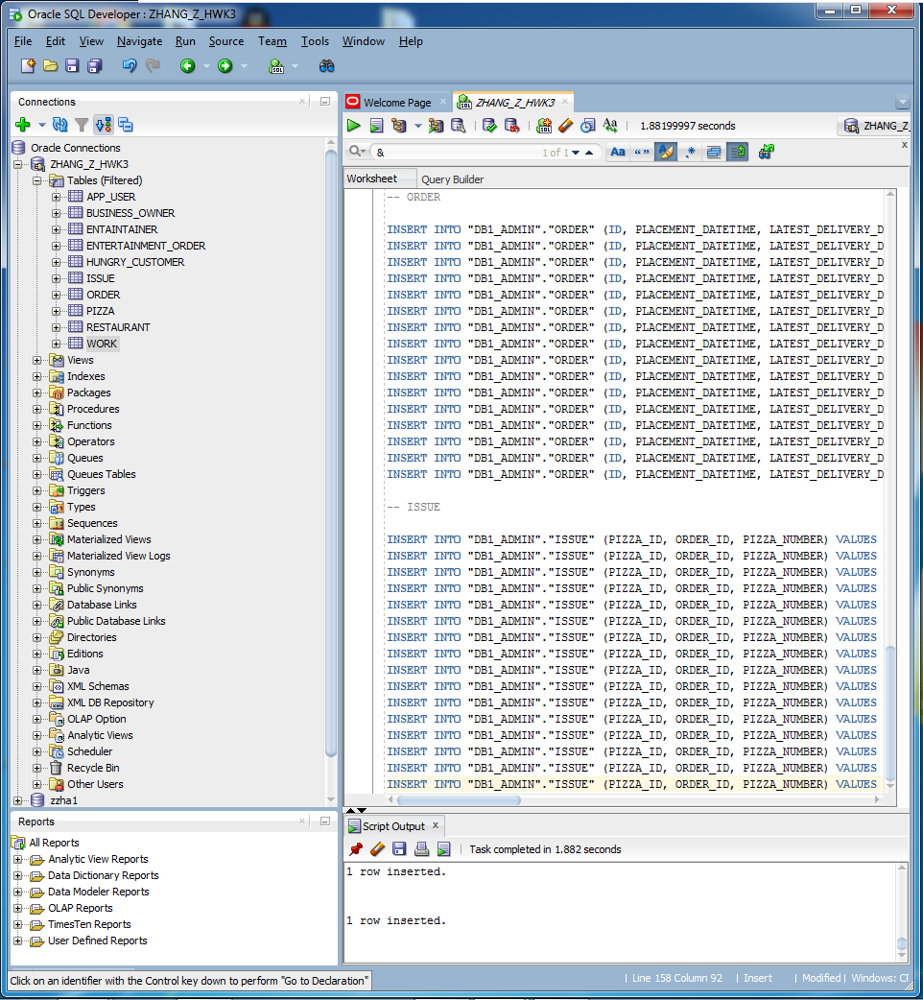

# Homework 03 - Part I

Zhicheng Zhang - G45149856


### Introduction

Create a database from data modeling to SQL realization. 


### Problem

> **Question 3.3** One of your (hipster) acquaintances thinks he has the next billion-dollar start-up idea for an app: Pizza Delivery with Entertainment. He heard from other people that you are following the course on database management, and asks you to design the EER model. Afterwards, he will use the EER model to ask programmers to implement the app.
>
> He explains the basic functionality of the app as follows: customers can order pizzas from restaurants to get delivered to a specific address, and if they want to, they can choose a special “entertainment order.” The following is a detailed explanation of the range of capabilities of the app.
>
> When people create an account for the app and become app users, they have to indicate their birthday and fill in their name and address. Every user should also be uniquely identifiable.
>
> Once the account is created, the users should be presented with three options.
>
> The first option in the app is to select “business owner.” We also ask these business owners to provide their LinkedIn account so we can add them to our professional network. Each business owner can own a number of pizza restaurants. Of these pizza restaurants, we want to register the zip code, address, phone number, website, and the opening hours.
>
> Each pizza restaurant can offer a number of pizzas. Of those pizzas, we want to keep the name (e.g., margherita, quattro stagioni), the crust structure (for example, classic Italian crust, deep dish crust, cheese crust), and the price. While two pizzas from different pizza restaurants may have the same name, they will not be exactly the same, as the taste will be different, and thus should be considered unique. Moreover, pizzas should be distinguishable even if they have the same price, e.g., a pizza margherita from Pizza Pronto in New York that costs €12 must be distinguishable from a pizza margherita from Pizza Rapido in Singapore, which also costs €12.
>
> The second option in the app is to select “hungry customer.” Of those hungry customers, we need a delivery address. Hungry customers can make orders for pizzas. Each order gets assigned an ID, and we want our app to log the date and time when the order was placed. We also allow the hungry customer to indicate the latest time of delivery, and ask how many people the order is for. An order can be for one or more pizzas.
>
> A special type of order can be made: the entertainment order. When an order is an entertainment order, the delivery person stays with the customer after delivering the pizza and entertains the customers (e.g., singing, making jokes, doing magic tricks) for a certain amount of time. When a hungry customer indicates that he or she wants to be entertained while eating the pizza, we not only want to register all the regular order information, but also the type of entertainment the user requests, and for how long (a duration).
>
> The third option in the app is that of “entertainer.” When users select entertainer, they need to provide a stage name, write a short bio about themselves, and indicate their price per 30 minutes. Every entertainment order is fulfilled by exactly one entertainer. Every entertainer can choose for which pizza restaurant(s) he or she wants to work. For each pizza restaurant an entertainer wants to work with, he or she should indicate his or her availability by day (Monday, Tuesday, Wednesday, etc.).
>
> Make an EER model to model the data requirements.
>
> **Suggested EER Diagram follows. Please do not attempt to convert this EER diagram item by item to the Oracle Datamodeler. Use it to extract business required entity sets, business rules, relationships and types of relationships.**
>
> **In other words, your solution is not a translation of this EER diagram.**

<div style="page-break-after: always;"></div>

### Solution

#### a, d, f

> (a) Review the problem 3.1 statement and the textbook author’s EER diagram. Read the textbook to understand the authors EER diagram and extract suggested entities, relationships, and business rules. Most importantly extract every business rule to be included in your own database conceptual design for which you will use the Oracle Datamodeler.
>
> (d) Identify and list the entity sets.
>
> (f) Identify and list the business rules associate with each entity set.

Entity:

- app user
- business owner
- hungry customer
- entertainer
- restaurant
- pizza
- order
- entertainment order

Relationship:

- <u>Business owner</u>, <u>hungry customer</u>, and <u>entertainer</u> are **belong** to <u>app user</u>, which means they are subclasses.
- Each <u>business owner</u> **owns** 1+ <u>restaurants</u>.
- Each <u>restaurant</u> **provides** 1+ kinds of <u>pizza</u>.
- Each <u>hungry customer</u> **places** 1+ <u>orders</u>, 
- Each <u>orders</u> **is** an <u>entertainment order</u>.
- Each <u>entertainer</u> **works for** 1+ <u>restaurants</u> and **fulfills** 1+ <u>entertainment order</u>.

Business Rule:

- <u>App user</u> is **one of** <u>business owner</u>, <u>hungry customer</u> or <u>entertainer</u>.
- Each <u>business owner</u> owns **1+** <u>restaurants</u>.
- Each <u>pizza restaurant</u> offers **1+** <u>pizzas</u>.
- Each <u>pizza</u> in each restaurant is **unique**.
- Each <u>order</u> is placed by **1** <u>hungry customer</u>.
- Each <u>customer</u> places **1+** <u>orders</u>.
- Each <u>order</u> contains **1+** of entertaining type.
- Each <u>entertainment order</u> is fulfilled by **1** <u>entertainer</u>
- Each <u>entertainer</u> **works for** 1+ <u>restaurants</u> and **fulfills** 1+ <u>entertainment order</u>.

#### b

> (b) Describe the organization and the purpose of the database to be designed.

This database is used to deal with the pizza order which placed by hungry customer made by restaurant.

<div style="page-break-after: always;"></div>

#### c

> (c) Using the Oracle Datamodeler, build a dataflow diagram for the "Pizza Sales Report System".



#### e, h

> (e) Identify the list of attributes and the ID for each entity set (this will be the possible natural key).
>
> (h) For each entity set identify a surrogate key or artificial key, if need it. This will be the Primary Key on the relational diagram and the ID identified as the NATURAL KEY. Both, the Primary key and the natural key need to be given the UNIQUE and NOT NULL constraints. These are the basic properties of the Primary and candidate Key.

APP_USER:

- <u>ID</u>
- NAME
- DATE_OF_BIRTH
- SEX

BUSINESS_OWNER:

- <u>ID</u>
- WEBSITE

HUNGRY_CUSTOMER:

- <u>ID</u>
- DELIVERY_DETAIL_ADDRESS
- DELIVERY_ZIP_CODE

ENTERTAINER:

- <u>ID</u>
- STAGE_NAME
- SHORT_BIO
- PROCE

RESTAURANT:

- <u>ID</u>
- NAME
- ZIP_CODE
- DETAILED_ADDRESS
- HOURS
- PHONE
- WEBSITE

PIZZA:

- <u>ID</u>
- NAME
- CRUST_STRUCTURE
- PRICE

PIZZA_ORDER:

- <u>ID</u>
- PLACEMENT_DATETIME
- LATEST_DELIVERY_DATETIME
- PEOPLE_NUMBER

ENTERTAINMENT_ORDER:

- <u>ID</u>
- TYPE
- DURATION

#### g

> (g) Identify and list the relationships among the entity sets and indicate if they are one-to-one, one-to-many, or many-to-many relationships.

| Entity          | Relationship | Entity              |
| --------------- | ------------ | ------------------- |
| business Owner  | 1 vs. 1+     | restaurant          |
| restaurant      | 1 vs. 1+     | pizza               |
| hungry customer | 1 vs. 1+     | order               |
| order           | 1 vs. 1+     | pizza               |
| order           | 1 vs. 1      | entertainment order |
| entertainer     | 1+ vs. 1+    | restaurant          |
| entertainer     | 1 vs 1+      | entertainment       |

<u>Business owner</u>, <u>hungry customer</u> and <u>entertainer</u> must be an <u>app user</u> (1 vs. 1). 

<div style="page-break-after: always;"></div>

#### i

> (i) Using the Oracle Datamodeler build the EER diagram (database conceptual design). All business rules identified above must be entered into the Oracle Data Modeler.




<div style="page-break-after: always;"></div>

#### j

> (j) Proceed to convert the EER diagram into a Relational Diagram. Make sure all the constraints, naming convention, etc. have been followed in your Data Model.

There are 2 bugs when first generating the relational data model.



1. The foreign key `ENTERTAINMENT_ORDER_DETAIL` is generated as mandatory. Based on the EER diagram, it should be optional.

2. The foreign key `ENTERTAINMENT_ORDER_ENTERTAINMENT_FK` is too long, which will cause the following error when generating the DDL.

   ``` sql
   --  ERROR: FK name length exceeds maximum allowed length(30) 
   ALTER TABLE entertainment_order
       ADD CONSTRAINT entertainment_order_entaintainer_fk FOREIGN KEY ( entaintainer_id )
           REFERENCES entaintainer ( id );
   ```

<div style="page-break-after: always;"></div>

After Fixing aforementioned bugs,  the relational diagram will be:



<div style="page-break-after: always;"></div>

#### k, l

> (k) Review the Relational diagram and identify missing item or corrections that are needed in the data model. For example, missing entities, relationships, missing constraints, etc. If corrections are needed, make the corrections on the EER diagram and re-generate the relational diagram.
>
> (l) Once you have finalized the EER diagram, proceed to generate the DDL.

The DDL file is generated as following:

``` sql
-- Generated by Oracle SQL Developer Data Modeler 19.4.0.350.1424
--   at:        2020-04-14 18:34:05 EDT
--   site:      Oracle Database 11g
--   type:      Oracle Database 11g

CREATE TABLE app_user (
    id             INTEGER NOT NULL,
    name           VARCHAR2(256 CHAR) NOT NULL,
    date_of_birth  DATE NOT NULL,
    sex            VARCHAR2(16 CHAR) NOT NULL
);

ALTER TABLE app_user ADD CONSTRAINT app_user_pk PRIMARY KEY ( id );

CREATE TABLE business_owner (
    id           INTEGER NOT NULL,
    website      VARCHAR2(256 CHAR) NOT NULL,
    app_user_id  INTEGER NOT NULL
);

CREATE UNIQUE INDEX business_owner__idx ON
    business_owner (
        app_user_id
    ASC );

ALTER TABLE business_owner ADD CONSTRAINT business_owner_pk PRIMARY KEY ( id );

CREATE TABLE entertainer (
    id           INTEGER NOT NULL,
    stage_name   VARCHAR2(256 CHAR) NOT NULL,
    short_bio    VARCHAR2(256 CHAR) NOT NULL,
    price        INTEGER NOT NULL,
    app_user_id  INTEGER NOT NULL
);

CREATE UNIQUE INDEX entaintainer__idx ON
    entertainer (
        app_user_id
    ASC );

ALTER TABLE entertainer ADD CONSTRAINT entertainer_pk PRIMARY KEY ( id );

CREATE TABLE entertainment_order (
    id              INTEGER NOT NULL,
    type            VARCHAR2(256 CHAR) NOT NULL,
    duration        INTEGER NOT NULL,
    entertainer_id  INTEGER NOT NULL
);

ALTER TABLE entertainment_order ADD CONSTRAINT entertainment_order_pk PRIMARY KEY ( id );

CREATE TABLE hungry_customer (
    id                       INTEGER NOT NULL,
    delivery_detail_address  VARCHAR2(256 CHAR) NOT NULL,
    delivery_zip_code        VARCHAR2(16 CHAR) NOT NULL,
    app_user_id              INTEGER NOT NULL
);

CREATE UNIQUE INDEX hungry_customer__idx ON
    hungry_customer (
        app_user_id
    ASC );

ALTER TABLE hungry_customer ADD CONSTRAINT hungry_customer_pk PRIMARY KEY ( id );

CREATE TABLE issue (
    pizza_id        INTEGER NOT NULL,
    pizza_order_id  INTEGER NOT NULL,
    pizza_number    INTEGER NOT NULL
);

ALTER TABLE issue ADD CONSTRAINT issue_pk PRIMARY KEY ( pizza_id,
                                                        pizza_order_id );

CREATE TABLE pizza (
    id               INTEGER NOT NULL,
    name             VARCHAR2(256 CHAR) NOT NULL,
    crust_structure  VARCHAR2(256 CHAR) NOT NULL,
    price            INTEGER NOT NULL,
    restaurant_id    INTEGER NOT NULL
);

ALTER TABLE pizza ADD CONSTRAINT pizza_pk PRIMARY KEY ( id );

CREATE TABLE pizza_order (
    id                        INTEGER NOT NULL,
    placement_datetime        DATE NOT NULL,
    latest_delivery_datetime  DATE NOT NULL,
    people_number             INTEGER NOT NULL,
    entertainment_order_id    INTEGER,
    hungry_customer_id        INTEGER NOT NULL
);

CREATE UNIQUE INDEX order__idx ON
    pizza_order (
        entertainment_order_id
    ASC );

ALTER TABLE pizza_order ADD CONSTRAINT pizza_order_pk PRIMARY KEY ( id );

CREATE TABLE restaurant (
    id                 INTEGER NOT NULL,
    name               VARCHAR2(256 CHAR) NOT NULL,
    zip_code           VARCHAR2(16 CHAR) NOT NULL,
    detailed_address   VARCHAR2(256 CHAR) NOT NULL,
    hours              VARCHAR2(256 CHAR) NOT NULL,
    phone              VARCHAR2(16 CHAR) NOT NULL,
    website            VARCHAR2(256 CHAR) NOT NULL,
    business_owner_id  INTEGER NOT NULL
);

ALTER TABLE restaurant ADD CONSTRAINT restaurant_pk PRIMARY KEY ( id );

CREATE TABLE work (
    entaintainer_id  INTEGER NOT NULL,
    restaurant_id    INTEGER NOT NULL,
    weekday          VARCHAR2(16 CHAR) NOT NULL,
    start_time       DATE NOT NULL,
    end_time         DATE NOT NULL
);

ALTER TABLE work ADD CONSTRAINT work_pk PRIMARY KEY ( entaintainer_id,
                                                      restaurant_id );

ALTER TABLE business_owner
    ADD CONSTRAINT business_owner_app_user_fk FOREIGN KEY ( app_user_id )
        REFERENCES app_user ( id );

ALTER TABLE entertainer
    ADD CONSTRAINT entaintainer_app_user_fk FOREIGN KEY ( app_user_id )
        REFERENCES app_user ( id );

ALTER TABLE entertainment_order
    ADD CONSTRAINT entertainment_order_e_fk FOREIGN KEY ( entertainer_id )
        REFERENCES entertainer ( id );

ALTER TABLE hungry_customer
    ADD CONSTRAINT hungry_customer_app_user_fk FOREIGN KEY ( app_user_id )
        REFERENCES app_user ( id );

ALTER TABLE issue
    ADD CONSTRAINT issue_order_fk FOREIGN KEY ( pizza_order_id )
        REFERENCES pizza_order ( id );

ALTER TABLE issue
    ADD CONSTRAINT issue_pizza_fk FOREIGN KEY ( pizza_id )
        REFERENCES pizza ( id );

ALTER TABLE pizza_order
    ADD CONSTRAINT order_entertainment_order_fk FOREIGN KEY ( entertainment_order_id )
        REFERENCES entertainment_order ( id );

ALTER TABLE pizza_order
    ADD CONSTRAINT order_hungry_customer_fk FOREIGN KEY ( hungry_customer_id )
        REFERENCES hungry_customer ( id );

ALTER TABLE pizza
    ADD CONSTRAINT pizza_restaurant_fk FOREIGN KEY ( restaurant_id )
        REFERENCES restaurant ( id );

ALTER TABLE restaurant
    ADD CONSTRAINT restaurant_business_owner_fk FOREIGN KEY ( business_owner_id )
        REFERENCES business_owner ( id );

ALTER TABLE work
    ADD CONSTRAINT work_entaintainer_fk FOREIGN KEY ( entaintainer_id )
        REFERENCES entertainer ( id );

ALTER TABLE work
    ADD CONSTRAINT work_restaurant_fk FOREIGN KEY ( restaurant_id )
        REFERENCES restaurant ( id );

-- Oracle SQL Developer Data Modeler Summary Report: 
-- 
-- CREATE TABLE                            10
-- CREATE INDEX                             4
-- ALTER TABLE                             22
-- CREATE VIEW                              0
-- ALTER VIEW                               0
-- CREATE PACKAGE                           0
-- CREATE PACKAGE BODY                      0
-- CREATE PROCEDURE                         0
-- CREATE FUNCTION                          0
-- CREATE TRIGGER                           0
-- ALTER TRIGGER                            0
-- CREATE COLLECTION TYPE                   0
-- CREATE STRUCTURED TYPE                   0
-- CREATE STRUCTURED TYPE BODY              0
-- CREATE CLUSTER                           0
-- CREATE CONTEXT                           0
-- CREATE DATABASE                          0
-- CREATE DIMENSION                         0
-- CREATE DIRECTORY                         0
-- CREATE DISK GROUP                        0
-- CREATE ROLE                              0
-- CREATE ROLLBACK SEGMENT                  0
-- CREATE SEQUENCE                          0
-- CREATE MATERIALIZED VIEW                 0
-- CREATE MATERIALIZED VIEW LOG             0
-- CREATE SYNONYM                           0
-- CREATE TABLESPACE                        0
-- CREATE USER                              0
-- 
-- DROP TABLESPACE                          0
-- DROP DATABASE                            0
-- 
-- REDACTION POLICY                         0
-- 
-- ORDS DROP SCHEMA                         0
-- ORDS ENABLE SCHEMA                       0
-- ORDS ENABLE OBJECT                       0
-- 
-- ERRORS                                   0
-- WARNINGS                                 0
```

#### m, n, o

> (m) Create a script similar the sample database schema “Create_HR_Database_Schema.sql” to create the database schema for this assignment using the DDL created in the above step. This may require making updates in the Oracle Datamodeler to make sure all the needed REFERENTIAL INTEGRITY CONSTRAINTS are created (e.g. Primary Keys, UNIQUE Keys, Referential Integrity, NULL, NOT NULL, DEFAULT).
>
> (n) Using the Oracle SQL Developer, create an Oracle database userid “\<last-Name\>\_<first character of First name\>_HWK2” in the Oracle database “db1”. For example: **fernandez_rolando_HWK2**.
>
> (o) Run the script that creates the database schema into your userid created above.




<div style="page-break-after: always;"></div>



<div style="page-break-after: always;"></div>

#### p

> (p) Create INSERT statement to insert at least 8 rows in each table. Make sure that you need to load the parent tables first to avoid errors.

Script:

``` sql
-- APP_USER

INSERT INTO "DB1_ADMIN"."APP_USER" (ID, NAME, DATE_OF_BIRTH, SEX) VALUES ('1', 'Albert V. Mulkey', TO_DATE('1959-06-05 00:00:00', 'YYYY-MM-DD HH24:MI:SS'), 'male');
INSERT INTO "DB1_ADMIN"."APP_USER" (ID, NAME, DATE_OF_BIRTH, SEX) VALUES ('2', 'Vanessa W. Hamilton', TO_DATE('1990-02-21 00:00:00', 'YYYY-MM-DD HH24:MI:SS'), 'female');
INSERT INTO "DB1_ADMIN"."APP_USER" (ID, NAME, DATE_OF_BIRTH, SEX) VALUES ('3', 'Alfonso M. Dillard', TO_DATE('1935-08-19 00:00:00', 'YYYY-MM-DD HH24:MI:SS'), 'male');
INSERT INTO "DB1_ADMIN"."APP_USER" (ID, NAME, DATE_OF_BIRTH, SEX) VALUES ('4', 'Cheryl R. Bono', TO_DATE('1996-11-06 00:00:00', 'YYYY-MM-DD HH24:MI:SS'), 'female');
INSERT INTO "DB1_ADMIN"."APP_USER" (ID, NAME, DATE_OF_BIRTH, SEX) VALUES ('5', 'Diane F. Anderson', TO_DATE('1990-09-25 00:00:00', 'YYYY-MM-DD HH24:MI:SS'), 'female');
INSERT INTO "DB1_ADMIN"."APP_USER" (ID, NAME, DATE_OF_BIRTH, SEX) VALUES ('6', 'Charles M. Hay', TO_DATE('1961-08-02 00:00:00', 'YYYY-MM-DD HH24:MI:SS'), 'male');
INSERT INTO "DB1_ADMIN"."APP_USER" (ID, NAME, DATE_OF_BIRTH, SEX) VALUES ('7', 'Anne B. Bruner', TO_DATE('1997-10-12 00:00:00', 'YYYY-MM-DD HH24:MI:SS'), 'female');
INSERT INTO "DB1_ADMIN"."APP_USER" (ID, NAME, DATE_OF_BIRTH, SEX) VALUES ('8', 'Timothy B. Hinson', TO_DATE('1936-05-06 00:00:00', 'YYYY-MM-DD HH24:MI:SS'), 'male');
INSERT INTO "DB1_ADMIN"."APP_USER" (ID, NAME, DATE_OF_BIRTH, SEX) VALUES ('9', 'Clarence M. Fleet', TO_DATE('1996-08-05 00:00:00', 'YYYY-MM-DD HH24:MI:SS'), 'male');
INSERT INTO "DB1_ADMIN"."APP_USER" (ID, NAME, DATE_OF_BIRTH, SEX) VALUES ('10', 'Frank S. Richardson', TO_DATE('1969-04-04 00:00:00', 'YYYY-MM-DD HH24:MI:SS'), 'female');
INSERT INTO "DB1_ADMIN"."APP_USER" (ID, NAME, DATE_OF_BIRTH, SEX) VALUES ('11', 'Nell D. James', TO_DATE('1942-07-15 00:00:00', 'YYYY-MM-DD HH24:MI:SS'), 'female');
INSERT INTO "DB1_ADMIN"."APP_USER" (ID, NAME, DATE_OF_BIRTH, SEX) VALUES ('12', 'Diego M. Eastman', TO_DATE('1967-03-10 00:00:00', 'YYYY-MM-DD HH24:MI:SS'), 'male');
INSERT INTO "DB1_ADMIN"."APP_USER" (ID, NAME, DATE_OF_BIRTH, SEX) VALUES ('13', 'Timothy B. Wilkin', TO_DATE('1937-10-18 00:00:00', 'YYYY-MM-DD HH24:MI:SS'), 'male');
INSERT INTO "DB1_ADMIN"."APP_USER" (ID, NAME, DATE_OF_BIRTH, SEX) VALUES ('14', 'Tracy A. Lewis', TO_DATE('1976-05-01', 'YYYY-MM-DD HH24:MI:SS'), 'female');
INSERT INTO "DB1_ADMIN"."APP_USER" (ID, NAME, DATE_OF_BIRTH, SEX) VALUES ('15', 'Michael M. Elliott', TO_DATE('1961-06-24 00:00:00', 'YYYY-MM-DD HH24:MI:SS'), 'male');
INSERT INTO "DB1_ADMIN"."APP_USER" (ID, NAME, DATE_OF_BIRTH, SEX) VALUES ('16', 'Dortha D. Travers', TO_DATE('1968-07-16 00:00:00', 'YYYY-MM-DD HH24:MI:SS'), 'female');
INSERT INTO "DB1_ADMIN"."APP_USER" (ID, NAME, DATE_OF_BIRTH, SEX) VALUES ('17', 'Carl M. Smith', TO_DATE('1978-02-23 00:00:00', 'YYYY-MM-DD HH24:MI:SS'), 'male');
INSERT INTO "DB1_ADMIN"."APP_USER" (ID, NAME, DATE_OF_BIRTH, SEX) VALUES ('18', 'Ronnie H. Matheny', TO_DATE('1969-10-09 00:00:00', 'YYYY-MM-DD HH24:MI:SS'), 'male');
INSERT INTO "DB1_ADMIN"."APP_USER" (ID, NAME, DATE_OF_BIRTH, SEX) VALUES ('19', 'Elizabeth W. Truong', TO_DATE('1987-11-02 00:00:00', 'YYYY-MM-DD HH24:MI:SS'), 'female');
INSERT INTO "DB1_ADMIN"."APP_USER" (ID, NAME, DATE_OF_BIRTH, SEX) VALUES ('20', 'Horace H. Fugate', TO_DATE('1958-08-14 00:00:00', 'YYYY-MM-DD HH24:MI:SS'), 'male');
INSERT INTO "DB1_ADMIN"."APP_USER" (ID, NAME, DATE_OF_BIRTH, SEX) VALUES ('21', 'Christopher G. Williford', TO_DATE('1991-12-23 00:00:00', 'YYYY-MM-DD HH24:MI:SS'), 'male');
INSERT INTO "DB1_ADMIN"."APP_USER" (ID, NAME, DATE_OF_BIRTH, SEX) VALUES ('22', 'Cora B. Anderson', TO_DATE('1966-06-30 00:00:00', 'YYYY-MM-DD HH24:MI:SS'), 'female');
INSERT INTO "DB1_ADMIN"."APP_USER" (ID, NAME, DATE_OF_BIRTH, SEX) VALUES ('23', 'Kathryn C. Stewart', TO_DATE('1976-12-19 00:00:00', 'YYYY-MM-DD HH24:MI:SS'), 'female');
INSERT INTO "DB1_ADMIN"."APP_USER" (ID, NAME, DATE_OF_BIRTH, SEX) VALUES ('24', 'Randal I. Ratliff', TO_DATE('1992-11-14 00:00:00', 'YYYY-MM-DD HH24:MI:SS'), 'male');

-- BUSINESS_OWNER

INSERT INTO "DB1_ADMIN"."BUSINESS_OWNER" (ID, WEBSITE, APP_USER_ID) VALUES ('1', 'bosanioculo.com', '1');
INSERT INTO "DB1_ADMIN"."BUSINESS_OWNER" (ID, WEBSITE, APP_USER_ID) VALUES ('2', 'treathan.com', '6');
INSERT INTO "DB1_ADMIN"."BUSINESS_OWNER" (ID, WEBSITE, APP_USER_ID) VALUES ('3', 'productosdelrio.com', '10');
INSERT INTO "DB1_ADMIN"."BUSINESS_OWNER" (ID, WEBSITE, APP_USER_ID) VALUES ('4', 'pilladelblog.com', '12');
INSERT INTO "DB1_ADMIN"."BUSINESS_OWNER" (ID, WEBSITE, APP_USER_ID) VALUES ('5', 'barsideboard.com', '18');
INSERT INTO "DB1_ADMIN"."BUSINESS_OWNER" (ID, WEBSITE, APP_USER_ID) VALUES ('6', 'echollo.com', '20');
INSERT INTO "DB1_ADMIN"."BUSINESS_OWNER" (ID, WEBSITE, APP_USER_ID) VALUES ('7', 'rhtcpch.com', '22');
INSERT INTO "DB1_ADMIN"."BUSINESS_OWNER" (ID, WEBSITE, APP_USER_ID) VALUES ('8', 'ajag.com', '23');

-- ENTERTAINER

INSERT INTO "DB1_ADMIN"."ENTERTAINER" (ID, STAGE_NAME, SHORT_BIO, PRICE, APP_USER_ID) VALUES ('1', 'Griffin Montoya', 'I''m Griffin Montoya.', '1200', '2');
INSERT INTO "DB1_ADMIN"."ENTERTAINER" (ID, STAGE_NAME, SHORT_BIO, PRICE, APP_USER_ID) VALUES ('2', 'Joel Bean', 'I''m Joel Bean.', '1700', '4');
INSERT INTO "DB1_ADMIN"."ENTERTAINER" (ID, STAGE_NAME, SHORT_BIO, PRICE, APP_USER_ID) VALUES ('3', 'Edith Downs', 'I''m Edith Downs.', '2000', '5');
INSERT INTO "DB1_ADMIN"."ENTERTAINER" (ID, STAGE_NAME, SHORT_BIO, PRICE, APP_USER_ID) VALUES ('4', 'Keegan Camacho', 'I''m Keegan Camacho.', '1500', '9');
INSERT INTO "DB1_ADMIN"."ENTERTAINER" (ID, STAGE_NAME, SHORT_BIO, PRICE, APP_USER_ID) VALUES ('5', 'Indi Kirk', 'I''m Indi Kirk.', '1600', '14');
INSERT INTO "DB1_ADMIN"."ENTERTAINER" (ID, STAGE_NAME, SHORT_BIO, PRICE, APP_USER_ID) VALUES ('6', 'Moshe Beach', 'I''m Moshe Beach.', '1800', '19');
INSERT INTO "DB1_ADMIN"."ENTERTAINER" (ID, STAGE_NAME, SHORT_BIO, PRICE, APP_USER_ID) VALUES ('7', 'Daryl Matthews', 'I''m Daryl Matthews.', '1100', '21');
INSERT INTO "DB1_ADMIN"."ENTERTAINER" (ID, STAGE_NAME, SHORT_BIO, PRICE, APP_USER_ID) VALUES ('8', 'Millie Mclaughlin', 'I''m Millie Mclaughlin.', '1300', '24');

-- HUNGRY_CUSTOMER

INSERT INTO "DB1_ADMIN"."HUNGRY_CUSTOMER" (ID, DELIVERY_DETAIL_ADDRESS, DELIVERY_ZIP_CODE, APP_USER_ID) VALUES ('1', '2930 Custer Street', '16510', '3');
INSERT INTO "DB1_ADMIN"."HUNGRY_CUSTOMER" (ID, DELIVERY_DETAIL_ADDRESS, DELIVERY_ZIP_CODE, APP_USER_ID) VALUES ('2', '675 Indiana Avenue', '96819', '7');
INSERT INTO "DB1_ADMIN"."HUNGRY_CUSTOMER" (ID, DELIVERY_DETAIL_ADDRESS, DELIVERY_ZIP_CODE, APP_USER_ID) VALUES ('3', '1053 Bassel Street', '70357', '8');
INSERT INTO "DB1_ADMIN"."HUNGRY_CUSTOMER" (ID, DELIVERY_DETAIL_ADDRESS, DELIVERY_ZIP_CODE, APP_USER_ID) VALUES ('4', '2077 New York Avenue', '76110', '11');
INSERT INTO "DB1_ADMIN"."HUNGRY_CUSTOMER" (ID, DELIVERY_DETAIL_ADDRESS, DELIVERY_ZIP_CODE, APP_USER_ID) VALUES ('5', '4159 Cunningham Court', '48226', '13');
INSERT INTO "DB1_ADMIN"."HUNGRY_CUSTOMER" (ID, DELIVERY_DETAIL_ADDRESS, DELIVERY_ZIP_CODE, APP_USER_ID) VALUES ('6', '2998 Highland View Drive', '95814', '15');
INSERT INTO "DB1_ADMIN"."HUNGRY_CUSTOMER" (ID, DELIVERY_DETAIL_ADDRESS, DELIVERY_ZIP_CODE, APP_USER_ID) VALUES ('7', '161 Roosevelt Street', '94949', '16');
INSERT INTO "DB1_ADMIN"."HUNGRY_CUSTOMER" (ID, DELIVERY_DETAIL_ADDRESS, DELIVERY_ZIP_CODE, APP_USER_ID) VALUES ('8', '2869 George Avenue', '36608', '17');

-- RESTAURANT

INSERT INTO "DB1_ADMIN"."RESTAURANT" (ID, NAME, ZIP_CODE, DETAILED_ADDRESS, HOURS, PHONE, WEBSITE, BUSINESS_OWNER_ID) VALUES ('1', 'Duccini''s Pizza', '20009', '1778 U St NW, Washington', '6PM-2AM', '(202) 484-8484', 'duccinis.com', '1');
INSERT INTO "DB1_ADMIN"."RESTAURANT" (ID, NAME, ZIP_CODE, DETAILED_ADDRESS, HOURS, PHONE, WEBSITE, BUSINESS_OWNER_ID) VALUES ('2', 'Pizzeria Paradiso', '20007', '3282 M St NW', '12:30PM-9PM', '(202) 337-1245', 'eatyourpizza.com', '1');
INSERT INTO "DB1_ADMIN"."RESTAURANT" (ID, NAME, ZIP_CODE, DETAILED_ADDRESS, HOURS, PHONE, WEBSITE, BUSINESS_OWNER_ID) VALUES ('3', 'DC Pizza', '20036', '1103 19th St NW', '11:30AM-8PM', '(202) 331-1800', 'dcpizzaonline.com', '2');
INSERT INTO "DB1_ADMIN"."RESTAURANT" (ID, NAME, ZIP_CODE, DETAILED_ADDRESS, HOURS, PHONE, WEBSITE, BUSINESS_OWNER_ID) VALUES ('4', 'Pi Pizzeria', '20004', '910 F St NW', '11AM-11PM', '(202) 393-5484', 'places.singleplatform.com', '2');
INSERT INTO "DB1_ADMIN"."RESTAURANT" (ID, NAME, ZIP_CODE, DETAILED_ADDRESS, HOURS, PHONE, WEBSITE, BUSINESS_OWNER_ID) VALUES ('5', 'We, The Pizza', '20003', '305 Pennsylvania Ave. SE', '11AM-9:30PM', '(202) 544-4008', 'wethepizza.com', '3');
INSERT INTO "DB1_ADMIN"."RESTAURANT" (ID, NAME, ZIP_CODE, DETAILED_ADDRESS, HOURS, PHONE, WEBSITE, BUSINESS_OWNER_ID) VALUES ('6', 'Wiseguy Pizza', '20001', '300 Massachusetts Ave NW #1', '11AM-8:30PM', '(202) 408-7800', 'wiseguypizza.com', '3');
INSERT INTO "DB1_ADMIN"."RESTAURANT" (ID, NAME, ZIP_CODE, DETAILED_ADDRESS, HOURS, PHONE, WEBSITE, BUSINESS_OWNER_ID) VALUES ('7', 'Pizzeria Paradiso', '20036', '2003 P St NW', '1PM-9PM', '(202) 223-1245', 'eatyourpizza.com', '4');
INSERT INTO "DB1_ADMIN"."RESTAURANT" (ID, NAME, ZIP_CODE, DETAILED_ADDRESS, HOURS, PHONE, WEBSITE, BUSINESS_OWNER_ID) VALUES ('8', 'All-Purpose Shaw', '20001', '1250 9th St NW', '11AM-8:30PM', '(202) 849-6174', 'allpurposedc.com', '4');

-- WORK

INSERT INTO "DB1_ADMIN"."WORK" (ENTERTAINER_ID, RESTAURANT_ID, WEEKDAY, START_TIME, END_TIME) VALUES ('1', '1', 'Monday-Sunday', TO_DATE('1970-01-01 18:00:00', 'YYYY-MM-DD HH24:MI:SS'), TO_DATE('1970-01-01 02:00:00', 'YYYY-MM-DD HH24:MI:SS'));
INSERT INTO "DB1_ADMIN"."WORK" (ENTERTAINER_ID, RESTAURANT_ID, WEEKDAY, START_TIME, END_TIME) VALUES ('8', '1', 'Monday-Sunday', TO_DATE('1970-01-01 18:00:00', 'YYYY-MM-DD HH24:MI:SS'), TO_DATE('1970-01-01 02:00:00', 'YYYY-MM-DD HH24:MI:SS'));
INSERT INTO "DB1_ADMIN"."WORK" (ENTERTAINER_ID, RESTAURANT_ID, WEEKDAY, START_TIME, END_TIME) VALUES ('2', '2', 'Monday-Sunday', TO_DATE('1970-01-01 12:30:00', 'YYYY-MM-DD HH24:MI:SS'), TO_DATE('1970-01-01 21:00:00', 'YYYY-MM-DD HH24:MI:SS'));
INSERT INTO "DB1_ADMIN"."WORK" (ENTERTAINER_ID, RESTAURANT_ID, WEEKDAY, START_TIME, END_TIME) VALUES ('7', '2', 'Monday-Sunday', TO_DATE('1970-01-01 12:30:00', 'YYYY-MM-DD HH24:MI:SS'), TO_DATE('1970-01-01 21:00:00', 'YYYY-MM-DD HH24:MI:SS'));
INSERT INTO "DB1_ADMIN"."WORK" (ENTERTAINER_ID, RESTAURANT_ID, WEEKDAY, START_TIME, END_TIME) VALUES ('3', '3', 'Monday-Sunday', TO_DATE('1970-01-01 11:30:00', 'YYYY-MM-DD HH24:MI:SS'), TO_DATE('1970-01-01 20:00:00', 'YYYY-MM-DD HH24:MI:SS'));
INSERT INTO "DB1_ADMIN"."WORK" (ENTERTAINER_ID, RESTAURANT_ID, WEEKDAY, START_TIME, END_TIME) VALUES ('6', '3', 'Monday-Sunday', TO_DATE('1970-01-01 11:30:00', 'YYYY-MM-DD HH24:MI:SS'), TO_DATE('1970-01-01 20:00:00', 'YYYY-MM-DD HH24:MI:SS'));
INSERT INTO "DB1_ADMIN"."WORK" (ENTERTAINER_ID, RESTAURANT_ID, WEEKDAY, START_TIME, END_TIME) VALUES ('4', '4', 'Monday-Sunday', TO_DATE('1970-01-01 11:00:00', 'YYYY-MM-DD HH24:MI:SS'), TO_DATE('1970-01-01 23:00:00', 'YYYY-MM-DD HH24:MI:SS'));
INSERT INTO "DB1_ADMIN"."WORK" (ENTERTAINER_ID, RESTAURANT_ID, WEEKDAY, START_TIME, END_TIME) VALUES ('5', '4', 'Monday-Sunday', TO_DATE('1970-01-01 11:00:00', 'YYYY-MM-DD HH24:MI:SS'), TO_DATE('1970-01-01 23:00:00', 'YYYY-MM-DD HH24:MI:SS'));
INSERT INTO "DB1_ADMIN"."WORK" (ENTERTAINER_ID, RESTAURANT_ID, WEEKDAY, START_TIME, END_TIME) VALUES ('5', '5', 'Monday-Sunday', TO_DATE('1970-01-01 11:00:00', 'YYYY-MM-DD HH24:MI:SS'), TO_DATE('1970-01-01 21:30:00', 'YYYY-MM-DD HH24:MI:SS'));
INSERT INTO "DB1_ADMIN"."WORK" (ENTERTAINER_ID, RESTAURANT_ID, WEEKDAY, START_TIME, END_TIME) VALUES ('4', '5', 'Monday-Sunday', TO_DATE('1970-01-01 11:00:00', 'YYYY-MM-DD HH24:MI:SS'), TO_DATE('1970-01-01 21:30:00', 'YYYY-MM-DD HH24:MI:SS'));
INSERT INTO "DB1_ADMIN"."WORK" (ENTERTAINER_ID, RESTAURANT_ID, WEEKDAY, START_TIME, END_TIME) VALUES ('6', '6', 'Monday-Sunday', TO_DATE('1970-01-01 11:00:00', 'YYYY-MM-DD HH24:MI:SS'), TO_DATE('1970-01-01 20:30:00', 'YYYY-MM-DD HH24:MI:SS'));
INSERT INTO "DB1_ADMIN"."WORK" (ENTERTAINER_ID, RESTAURANT_ID, WEEKDAY, START_TIME, END_TIME) VALUES ('3', '6', 'Monday-Sunday', TO_DATE('1970-01-01 11:00:00', 'YYYY-MM-DD HH24:MI:SS'), TO_DATE('1970-01-01 20:30:00', 'YYYY-MM-DD HH24:MI:SS'));
INSERT INTO "DB1_ADMIN"."WORK" (ENTERTAINER_ID, RESTAURANT_ID, WEEKDAY, START_TIME, END_TIME) VALUES ('7', '7', 'Monday-Sunday', TO_DATE('1970-01-01 13:00:00', 'YYYY-MM-DD HH24:MI:SS'), TO_DATE('1970-01-01 21:00:00', 'YYYY-MM-DD HH24:MI:SS'));
INSERT INTO "DB1_ADMIN"."WORK" (ENTERTAINER_ID, RESTAURANT_ID, WEEKDAY, START_TIME, END_TIME) VALUES ('2', '7', 'Monday-Sunday', TO_DATE('1970-01-01 13:00:00', 'YYYY-MM-DD HH24:MI:SS'), TO_DATE('1970-01-01 21:00:00', 'YYYY-MM-DD HH24:MI:SS'));
INSERT INTO "DB1_ADMIN"."WORK" (ENTERTAINER_ID, RESTAURANT_ID, WEEKDAY, START_TIME, END_TIME) VALUES ('8', '8', 'Monday-Sunday', TO_DATE('1970-01-01 11:00:00', 'YYYY-MM-DD HH24:MI:SS'), TO_DATE('1970-01-01 20:30:00', 'YYYY-MM-DD HH24:MI:SS'));
INSERT INTO "DB1_ADMIN"."WORK" (ENTERTAINER_ID, RESTAURANT_ID, WEEKDAY, START_TIME, END_TIME) VALUES ('1', '8', 'Monday-Sunday', TO_DATE('1970-01-01 11:00:00', 'YYYY-MM-DD HH24:MI:SS'), TO_DATE('1970-01-01 20:30:00', 'YYYY-MM-DD HH24:MI:SS'));

-- PIZZA

INSERT INTO "DB1_ADMIN"."PIZZA" (ID, NAME, CRUST_STRUCTURE, PRICE, RESTAURANT_ID) VALUES ('1', 'MARGHERITA', 'Paradiso Tomato Sauce, Basil, Buffalo Mozzarella', '2000', '7');
INSERT INTO "DB1_ADMIN"."PIZZA" (ID, NAME, CRUST_STRUCTURE, PRICE, RESTAURANT_ID) VALUES ('2', 'MACELLAIO', 'Paradiso Tomato Sauce, Pepperoni, Mozzarella, Pork Sausage, Red Onions', '2100', '7');
INSERT INTO "DB1_ADMIN"."PIZZA" (ID, NAME, CRUST_STRUCTURE, PRICE, RESTAURANT_ID) VALUES ('3', 'BOSCO', 'Paradiso Tomato Sauce, Spinach, Mozzarella, Mushrooms, Red Onions', '2000', '2');
INSERT INTO "DB1_ADMIN"."PIZZA" (ID, NAME, CRUST_STRUCTURE, PRICE, RESTAURANT_ID) VALUES ('4', 'QUATTRO FORMAGGI', 'Gorgonzola, Pecorino, Grana Padano, Mozzarella, Minced Garlic, Parsley', '2000', '2');
INSERT INTO "DB1_ADMIN"."PIZZA" (ID, NAME, CRUST_STRUCTURE, PRICE, RESTAURANT_ID) VALUES ('5', 'SANTA CRUZ', 'basil pesto, roasted artichokes, smoked onion, mozz, manchego', '2000', '8');
INSERT INTO "DB1_ADMIN"."PIZZA" (ID, NAME, CRUST_STRUCTURE, PRICE, RESTAURANT_ID) VALUES ('6', 'SEDGEWICK', 'whipped ricotta, mozz, taleggio, parm, truffle honey, chives', '2000', '8');
INSERT INTO "DB1_ADMIN"."PIZZA" (ID, NAME, CRUST_STRUCTURE, PRICE, RESTAURANT_ID) VALUES ('7', 'CHICKEN PANEER', 'House Masala Sauce (contains tree nuts), Marinated Chicken, Paneer Cheese, Light Green and Chili Peppers, Onions, Tomato, Cilantro, Jalapeno Sauce', '2649', '6');
INSERT INTO "DB1_ADMIN"."PIZZA" (ID, NAME, CRUST_STRUCTURE, PRICE, RESTAURANT_ID) VALUES ('8', 'SUPREME', 'Tomato Sauce, Pepperoni, Sausage, Green Pepper, Mushroom, Red Onions, Mozzarella', '2649', '6');
INSERT INTO "DB1_ADMIN"."PIZZA" (ID, NAME, CRUST_STRUCTURE, PRICE, RESTAURANT_ID) VALUES ('9', 'Ultimate Cheese', 'Our tomato sauce, fontina, taleggio, mozz, thyme, parsley oil drizzle', '2200', '5');
INSERT INTO "DB1_ADMIN"."PIZZA" (ID, NAME, CRUST_STRUCTURE, PRICE, RESTAURANT_ID) VALUES ('10', 'Double Pepperoni', 'Our tomato sauce, mozz, lotsa pepperoni, fresh oregano', '2200', '5');
INSERT INTO "DB1_ADMIN"."PIZZA" (ID, NAME, CRUST_STRUCTURE, PRICE, RESTAURANT_ID) VALUES ('11', 'Berkeley', 'mozzarella, portobella mushrooms, onions, kalamata olives, red bell peppers, garlic, and zucchini.', '2095', '4');
INSERT INTO "DB1_ADMIN"."PIZZA" (ID, NAME, CRUST_STRUCTURE, PRICE, RESTAURANT_ID) VALUES ('12', 'Lincoln Park', 'mozzarella, garlic olive oil, zucchini, fresh tomatoes, feta and fresh basil.', '1995', '4');
INSERT INTO "DB1_ADMIN"."PIZZA" (ID, NAME, CRUST_STRUCTURE, PRICE, RESTAURANT_ID) VALUES ('13', 'Cheese Pizza', 'cheese', '799', '3');
INSERT INTO "DB1_ADMIN"."PIZZA" (ID, NAME, CRUST_STRUCTURE, PRICE, RESTAURANT_ID) VALUES ('14', 'Four Topping Pizza', 'Build Your Own Pizza', '1049', '3');
INSERT INTO "DB1_ADMIN"."PIZZA" (ID, NAME, CRUST_STRUCTURE, PRICE, RESTAURANT_ID) VALUES ('15', 'Tomato and Cheese Pizza', 'selfserve', '1499', '1');
INSERT INTO "DB1_ADMIN"."PIZZA" (ID, NAME, CRUST_STRUCTURE, PRICE, RESTAURANT_ID) VALUES ('16', '4 item pizza', 'selfserve', '2099', '1');

-- ENTERTAINMENT_ORDER

INSERT INTO "DB1_ADMIN"."ENTERTAINMENT_ORDER" (ID, TYPE, DURATION, ENTERTAINER_ID) VALUES ('1', 'singing', '30', '1');
INSERT INTO "DB1_ADMIN"."ENTERTAINMENT_ORDER" (ID, TYPE, DURATION, ENTERTAINER_ID) VALUES ('2', 'making jokes', '30', '2');
INSERT INTO "DB1_ADMIN"."ENTERTAINMENT_ORDER" (ID, TYPE, DURATION, ENTERTAINER_ID) VALUES ('3', 'doing magic tricks', '30', '3');
INSERT INTO "DB1_ADMIN"."ENTERTAINMENT_ORDER" (ID, TYPE, DURATION, ENTERTAINER_ID) VALUES ('4', 'dancing', '30', '4');
INSERT INTO "DB1_ADMIN"."ENTERTAINMENT_ORDER" (ID, TYPE, DURATION, ENTERTAINER_ID) VALUES ('5', 'singing', '30', '5');
INSERT INTO "DB1_ADMIN"."ENTERTAINMENT_ORDER" (ID, TYPE, DURATION, ENTERTAINER_ID) VALUES ('6', 'making jokes', '30', '6');
INSERT INTO "DB1_ADMIN"."ENTERTAINMENT_ORDER" (ID, TYPE, DURATION, ENTERTAINER_ID) VALUES ('7', 'doing magic tricks', '30', '7');
INSERT INTO "DB1_ADMIN"."ENTERTAINMENT_ORDER" (ID, TYPE, DURATION, ENTERTAINER_ID) VALUES ('8', 'dancing', '30', '8');

-- PIZZA_ORDER

INSERT INTO "DB1_ADMIN"."PIZZA_ORDER" (ID, PLACEMENT_DATETIME, LATEST_DELIVERY_DATETIME, PEOPLE_NUMBER, ENTERTAINMENT_ORDER_ID, HUNGRY_CUSTOMER_ID) VALUES ('1', TO_DATE('2020-04-14 20:44:29', 'YYYY-MM-DD HH24:MI:SS'), TO_DATE('2020-04-15 20:45:17', 'YYYY-MM-DD HH24:MI:SS'), '2', '1', '1');
INSERT INTO "DB1_ADMIN"."PIZZA_ORDER" (ID, PLACEMENT_DATETIME, LATEST_DELIVERY_DATETIME, PEOPLE_NUMBER, ENTERTAINMENT_ORDER_ID, HUNGRY_CUSTOMER_ID) VALUES ('2', TO_DATE('2020-04-14 14:44:32', 'YYYY-MM-DD HH24:MI:SS'), TO_DATE('2020-04-15 14:45:20', 'YYYY-MM-DD HH24:MI:SS'), '3', '2', '2');
INSERT INTO "DB1_ADMIN"."PIZZA_ORDER" (ID, PLACEMENT_DATETIME, LATEST_DELIVERY_DATETIME, PEOPLE_NUMBER, ENTERTAINMENT_ORDER_ID, HUNGRY_CUSTOMER_ID) VALUES ('3', TO_DATE('2020-04-14 14:44:35', 'YYYY-MM-DD HH24:MI:SS'), TO_DATE('2020-04-15 14:45:22', 'YYYY-MM-DD HH24:MI:SS'), '4', '3', '3');
INSERT INTO "DB1_ADMIN"."PIZZA_ORDER" (ID, PLACEMENT_DATETIME, LATEST_DELIVERY_DATETIME, PEOPLE_NUMBER, ENTERTAINMENT_ORDER_ID, HUNGRY_CUSTOMER_ID) VALUES ('4', TO_DATE('2020-04-14 14:44:38', 'YYYY-MM-DD HH24:MI:SS'), TO_DATE('2020-04-15 14:45:25', 'YYYY-MM-DD HH24:MI:SS'), '6', '4', '4');
INSERT INTO "DB1_ADMIN"."PIZZA_ORDER" (ID, PLACEMENT_DATETIME, LATEST_DELIVERY_DATETIME, PEOPLE_NUMBER, ENTERTAINMENT_ORDER_ID, HUNGRY_CUSTOMER_ID) VALUES ('5', TO_DATE('2020-04-14 14:44:41', 'YYYY-MM-DD HH24:MI:SS'), TO_DATE('2020-04-15 14:45:27', 'YYYY-MM-DD HH24:MI:SS'), '5', '5', '5');
INSERT INTO "DB1_ADMIN"."PIZZA_ORDER" (ID, PLACEMENT_DATETIME, LATEST_DELIVERY_DATETIME, PEOPLE_NUMBER, ENTERTAINMENT_ORDER_ID, HUNGRY_CUSTOMER_ID) VALUES ('6', TO_DATE('2020-04-14 14:44:44', 'YYYY-MM-DD HH24:MI:SS'), TO_DATE('2020-04-15 14:45:30', 'YYYY-MM-DD HH24:MI:SS'), '1', '6', '6');
INSERT INTO "DB1_ADMIN"."PIZZA_ORDER" (ID, PLACEMENT_DATETIME, LATEST_DELIVERY_DATETIME, PEOPLE_NUMBER, ENTERTAINMENT_ORDER_ID, HUNGRY_CUSTOMER_ID) VALUES ('7', TO_DATE('2020-04-14 14:44:47', 'YYYY-MM-DD HH24:MI:SS'), TO_DATE('2020-04-15 14:45:33', 'YYYY-MM-DD HH24:MI:SS'), '8', '7', '7');
INSERT INTO "DB1_ADMIN"."PIZZA_ORDER" (ID, PLACEMENT_DATETIME, LATEST_DELIVERY_DATETIME, PEOPLE_NUMBER, ENTERTAINMENT_ORDER_ID, HUNGRY_CUSTOMER_ID) VALUES ('8', TO_DATE('2020-04-14 14:44:50', 'YYYY-MM-DD HH24:MI:SS'), TO_DATE('2020-04-15 14:45:36', 'YYYY-MM-DD HH24:MI:SS'), '7', '8', '8');
INSERT INTO "DB1_ADMIN"."PIZZA_ORDER" (ID, PLACEMENT_DATETIME, LATEST_DELIVERY_DATETIME, PEOPLE_NUMBER, HUNGRY_CUSTOMER_ID) VALUES ('9', TO_DATE('2020-04-14 16:41:03', 'YYYY-MM-DD HH24:MI:SS'), TO_DATE('2020-04-15 16:41:22', 'YYYY-MM-DD HH24:MI:SS'), '4', '1');
INSERT INTO "DB1_ADMIN"."PIZZA_ORDER" (ID, PLACEMENT_DATETIME, LATEST_DELIVERY_DATETIME, PEOPLE_NUMBER, HUNGRY_CUSTOMER_ID) VALUES ('10', TO_DATE('2020-04-14 16:41:07', 'YYYY-MM-DD HH24:MI:SS'), TO_DATE('2020-04-15 16:41:26', 'YYYY-MM-DD HH24:MI:SS'), '4', '2');
INSERT INTO "DB1_ADMIN"."PIZZA_ORDER" (ID, PLACEMENT_DATETIME, LATEST_DELIVERY_DATETIME, PEOPLE_NUMBER, HUNGRY_CUSTOMER_ID) VALUES ('11', TO_DATE('2020-04-14 16:41:10', 'YYYY-MM-DD HH24:MI:SS'), TO_DATE('2020-04-15 16:41:29', 'YYYY-MM-DD HH24:MI:SS'), '4', '3');
INSERT INTO "DB1_ADMIN"."PIZZA_ORDER" (ID, PLACEMENT_DATETIME, LATEST_DELIVERY_DATETIME, PEOPLE_NUMBER, HUNGRY_CUSTOMER_ID) VALUES ('12', TO_DATE('2020-04-14 16:41:12', 'YYYY-MM-DD HH24:MI:SS'), TO_DATE('2020-04-15 16:41:32', 'YYYY-MM-DD HH24:MI:SS'), '4', '4');
INSERT INTO "DB1_ADMIN"."PIZZA_ORDER" (ID, PLACEMENT_DATETIME, LATEST_DELIVERY_DATETIME, PEOPLE_NUMBER, HUNGRY_CUSTOMER_ID) VALUES ('13', TO_DATE('2020-04-14 16:41:13', 'YYYY-MM-DD HH24:MI:SS'), TO_DATE('2020-04-15 16:41:35', 'YYYY-MM-DD HH24:MI:SS'), '4', '5');
INSERT INTO "DB1_ADMIN"."PIZZA_ORDER" (ID, PLACEMENT_DATETIME, LATEST_DELIVERY_DATETIME, PEOPLE_NUMBER, HUNGRY_CUSTOMER_ID) VALUES ('14', TO_DATE('2020-04-14 16:41:16', 'YYYY-MM-DD HH24:MI:SS'), TO_DATE('2020-04-15 16:41:37', 'YYYY-MM-DD HH24:MI:SS'), '4', '6');
INSERT INTO "DB1_ADMIN"."PIZZA_ORDER" (ID, PLACEMENT_DATETIME, LATEST_DELIVERY_DATETIME, PEOPLE_NUMBER, HUNGRY_CUSTOMER_ID) VALUES ('15', TO_DATE('2020-04-14 16:41:18', 'YYYY-MM-DD HH24:MI:SS'), TO_DATE('2020-04-15 16:41:40', 'YYYY-MM-DD HH24:MI:SS'), '4', '7');
INSERT INTO "DB1_ADMIN"."PIZZA_ORDER" (ID, PLACEMENT_DATETIME, LATEST_DELIVERY_DATETIME, PEOPLE_NUMBER, HUNGRY_CUSTOMER_ID) VALUES ('16', TO_DATE('2020-04-14 16:41:20', 'YYYY-MM-DD HH24:MI:SS'), TO_DATE('2020-04-15 16:41:43', 'YYYY-MM-DD HH24:MI:SS'), '4', '8');

-- ISSUE

INSERT INTO "DB1_ADMIN"."ISSUE" (PIZZA_ID, PIZZA_ORDER_ID, PIZZA_NUMBER) VALUES ('15', '1', '2');
INSERT INTO "DB1_ADMIN"."ISSUE" (PIZZA_ID, PIZZA_ORDER_ID, PIZZA_NUMBER) VALUES ('3', '2', '2');
INSERT INTO "DB1_ADMIN"."ISSUE" (PIZZA_ID, PIZZA_ORDER_ID, PIZZA_NUMBER) VALUES ('13', '3', '2');
INSERT INTO "DB1_ADMIN"."ISSUE" (PIZZA_ID, PIZZA_ORDER_ID, PIZZA_NUMBER) VALUES ('11', '4', '2');
INSERT INTO "DB1_ADMIN"."ISSUE" (PIZZA_ID, PIZZA_ORDER_ID, PIZZA_NUMBER) VALUES ('9', '5', '2');
INSERT INTO "DB1_ADMIN"."ISSUE" (PIZZA_ID, PIZZA_ORDER_ID, PIZZA_NUMBER) VALUES ('7', '6', '2');
INSERT INTO "DB1_ADMIN"."ISSUE" (PIZZA_ID, PIZZA_ORDER_ID, PIZZA_NUMBER) VALUES ('1', '7', '2');
INSERT INTO "DB1_ADMIN"."ISSUE" (PIZZA_ID, PIZZA_ORDER_ID, PIZZA_NUMBER) VALUES ('5', '8', '2');
INSERT INTO "DB1_ADMIN"."ISSUE" (PIZZA_ID, PIZZA_ORDER_ID, PIZZA_NUMBER) VALUES ('16', '9', '2');
INSERT INTO "DB1_ADMIN"."ISSUE" (PIZZA_ID, PIZZA_ORDER_ID, PIZZA_NUMBER) VALUES ('4', '10', '2');
INSERT INTO "DB1_ADMIN"."ISSUE" (PIZZA_ID, PIZZA_ORDER_ID, PIZZA_NUMBER) VALUES ('14', '11', '2');
INSERT INTO "DB1_ADMIN"."ISSUE" (PIZZA_ID, PIZZA_ORDER_ID, PIZZA_NUMBER) VALUES ('12', '12', '2');
INSERT INTO "DB1_ADMIN"."ISSUE" (PIZZA_ID, PIZZA_ORDER_ID, PIZZA_NUMBER) VALUES ('10', '13', '2');
INSERT INTO "DB1_ADMIN"."ISSUE" (PIZZA_ID, PIZZA_ORDER_ID, PIZZA_NUMBER) VALUES ('8', '14', '2');
INSERT INTO "DB1_ADMIN"."ISSUE" (PIZZA_ID, PIZZA_ORDER_ID, PIZZA_NUMBER) VALUES ('2', '15', '2');
INSERT INTO "DB1_ADMIN"."ISSUE" (PIZZA_ID, PIZZA_ORDER_ID, PIZZA_NUMBER) VALUES ('6', '16', '2');
```

<div style="page-break-after: always;"></div>

Result:



<div style="page-break-after: always;"></div>

#### q

> (q) Create at least 5 select statements to display data from the database schema.

Script:

``` sql
SELECT a.NAME, a.DATE_OF_BIRTH, a.SEX, b.WEBSITE FROM APP_USER a JOIN BUSINESS_OWNER b on a.ID = b.APP_USER_ID;

SELECT a.NAME, a.DATE_OF_BIRTH, a.SEX, b.STAGE_NAME, b.SHORT_BIO, b.PRICE FROM APP_USER a JOIN ENTERTAINER b on a.ID = b.APP_USER_ID;

SELECT a.NAME, a.DATE_OF_BIRTH, a.SEX, b.DELIVERY_DETAIL_ADDRESS, b.DELIVERY_ZIP_CODE FROM APP_USER a JOIN HUNGRY_CUSTOMER b on a.ID = b.APP_USER_ID;

SELECT c.NAME, c.SEX, a.LATEST_DELIVERY_DATETIME, a.PEOPLE_NUMBER, e.NAME as PIZZA_NAME, d.PIZZA_NUMBER FROM PIZZA_ORDER a JOIN HUNGRY_CUSTOMER b on a.HUNGRY_CUSTOMER_ID = b.ID JOIN APP_USER c on b.APP_USER_ID = c.ID JOIN ISSUE d on a.ID = d.PIZZA_ORDER_ID JOIN PIZZA e on d.PIZZA_ID = e.ID;

SELECT c.NAME, c.SEX, a.LATEST_DELIVERY_DATETIME, a.PEOPLE_NUMBER, e.STAGE_NAME, d.TYPE, d.DURATION FROM PIZZA_ORDER a JOIN HUNGRY_CUSTOMER b on a.HUNGRY_CUSTOMER_ID = b.ID JOIN APP_USER c on b.APP_USER_ID = c.ID JOIN ENTERTAINMENT_ORDER d on a.ENTERTAINMENT_ORDER_ID = d.ID JOIN ENTERTAINER e on d.ENTERTAINER_ID = e.ID;
```

Result:


<div style="page-break-after: always;"></div>

#### r

> (r) Create at least 5 delete and 5 update SQL statements.

``` sql
-- UPDATE

UPDATE ENTERTAINER SET PRICE = '1245' WHERE ID = 1;
UPDATE ENTERTAINER SET PRICE = '1795' WHERE ID = 2;
UPDATE ENTERTAINER SET PRICE = '1995' WHERE ID = 3;
UPDATE ENTERTAINER SET PRICE = '1545' WHERE ID = 4;
UPDATE ENTERTAINER SET PRICE = '1695' WHERE ID = 5;
UPDATE ENTERTAINER SET PRICE = '1845' WHERE ID = 6;
UPDATE ENTERTAINER SET PRICE = '1145' WHERE ID = 7;
UPDATE ENTERTAINER SET PRICE = '1395' WHERE ID = 8;

-- DELETE

DELETE FROM ISSUE WHERE PIZZA_ORDER_ID = 11;
DELETE FROM ISSUE WHERE PIZZA_ORDER_ID = 12;
DELETE FROM ISSUE WHERE PIZZA_ORDER_ID = 13;
DELETE FROM ISSUE WHERE PIZZA_ORDER_ID = 14;
DELETE FROM ISSUE WHERE PIZZA_ORDER_ID = 15;
DELETE FROM ISSUE WHERE PIZZA_ORDER_ID = 16;
DELETE FROM PIZZA_ORDER WHERE ID = 11;
DELETE FROM PIZZA_ORDER WHERE ID = 12;
DELETE FROM PIZZA_ORDER WHERE ID = 13;
DELETE FROM PIZZA_ORDER WHERE ID = 14;
DELETE FROM PIZZA_ORDER WHERE ID = 15;
DELETE FROM PIZZA_ORDER WHERE ID = 16;
```

#### s

> (s)Build a PL/SQL procedure that creates a “Hungry Customers Report”. The reports contains the name, address, date of sale, pizza type, cost, and at the end the total costs. NOTE: the number of entities in your design could be larger that in the solution below. 

It is really hard for me to provide a prefect solution with cursor in PL/SQL (after trying so many time), so I just provide the core SQL query script.

``` sql
SELECT a.ID as HUNGRY_CUSTOMER_ID, b.NAME, a.DELIVERY_DETAIL_ADDRESS, a.DELIVERY_ZIP_CODE, c.LATEST_DELIVERY_DATETIME, e.NAME as PIZZA_NAME, e.PRICE, d.PIZZA_NUMBER
FROM HUNGRY_CUSTOMER a 
JOIN APP_USER b on a.APP_USER_ID = b.ID
JOIN PIZZA_ORDER c on c.HUNGRY_CUSTOMER_ID = a.ID
JOIN ISSUE d on d.PIZZA_ORDER_ID = c.ID
JOIN PIZZA e on e.ID = d.PIZZA_ID;
```

<div style="page-break-after: always;"></div>

### Summary

By doing this homework, I learn how to design a database system from data modeling to SQL realization. It is really a good experience.
